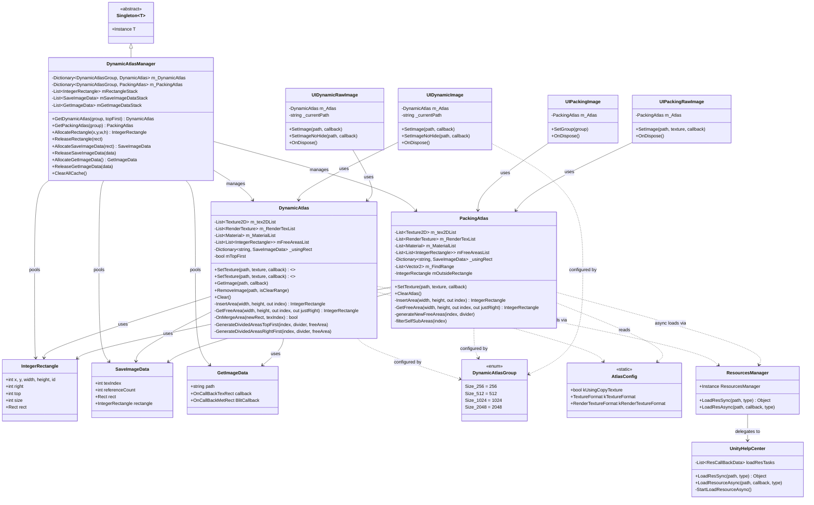
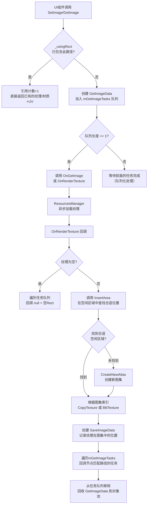
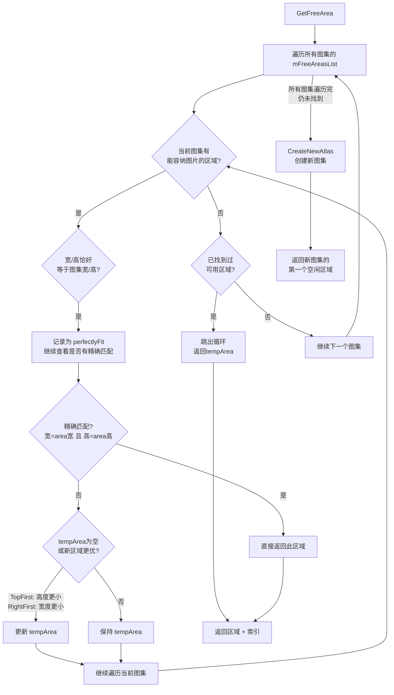
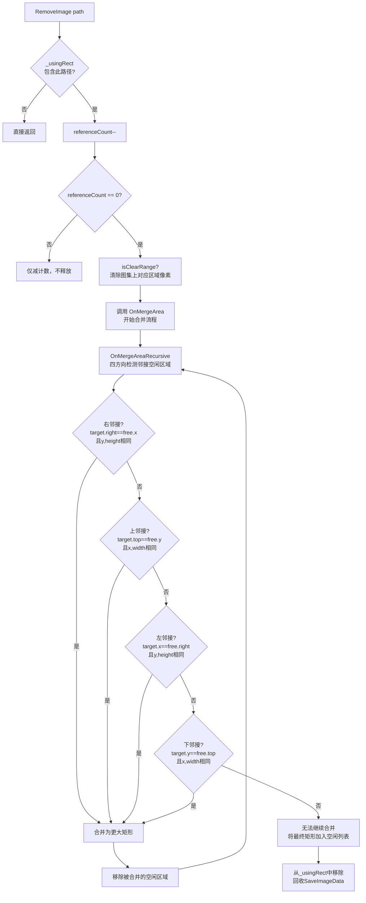
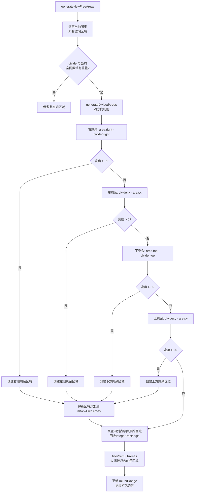

# 动态图集系统 - 项目分析文档

## 1. 项目概述

本项目是一个 **Unity 运行时动态图集（Dynamic Atlas）** 系统。它将运行时加载的小纹理动态打包到大图集纹理中，以减少 Draw Call 和纹理交换开销，适用于 Unity UI 系统（`UnityEngine.UI`）。

**核心价值**：多个零散的小图合并到一张大图上，UI 元素共享同一张纹理，GPU 可以批量渲染，显著提升 UI 渲染性能。

**技术栈**：Unity 2022+，C#，基于 `Resources.Load` / `Resources.LoadAsync` 加载资源。

---

## 2. 系统架构图

```
┌─────────────────────────────────────────────────────────────────┐
│                         UI Layer (Unity)                         │
│  ┌──────────────┐ ┌──────────────┐ ┌──────────────┐              │
│  │UIDynamicImage│ │UIDynamicRaw  │ │UIPackingImage│  ...         │
│  │  (Image)     │ │  Image       │ │  (Image)     │              │
│  └──────┬───────┘ └──────┬───────┘ └──────┬───────┘              │
│         │                │                │                       │
├─────────┼────────────────┼────────────────┼───────────────────────┤
│         ▼                ▼                ▼                       │
│  ┌──────────────────────────────────────────┐                    │
│  │        DynamicAtlasManager (Singleton)    │                    │
│  │  ┌─────────────────┐ ┌─────────────────┐ │                    │
│  │  │  DynamicAtlas   │ │  PackingAtlas   │ │                    │
│  │  │  (BSP算法)       │ │  (外接矩形算法)  │ │                    │
│  │  └────────┬────────┘ └────────┬────────┘ │                    │
│  │           │                   │           │                    │
│  │  ┌────────┴───────────────────┴────────┐  │                    │
│  │  │       Object Pool (对象池)           │  │                    │
│  │  │  IntegerRectangle / SaveImageData   │  │                    │
│  │  │  GetImageData                       │  │                    │
│  │  └─────────────────────────────────────┘  │                    │
│  └──────────────────────────────────────────┘                    │
│                         │                                        │
├─────────────────────────┼────────────────────────────────────────┤
│                         ▼                                         │
│  ┌──────────────────────────────────────────┐                    │
│  │         Resource Loading Layer            │                    │
│  │  ┌──────────────┐ ┌────────────────────┐ │                    │
│  │  │ResourcesManager│ │ UnityHelpCenter   │ │                    │
│  │  │   (Proxy)     │ │ (MonoBehaviour)    │ │                    │
│  │  │               │ │ Coroutine Loader   │ │                    │
│  │  └──────────────┘ └────────────────────┘ │                    │
│  └──────────────────────────────────────────┘                    │
│                         │                                        │
├─────────────────────────┼────────────────────────────────────────┤
│                         ▼                                         │
│  ┌──────────────────────────────────────────┐                    │
│  │         Unity Resources System            │                    │
│  │         Resources/ 目录下的纹理资源         │                    │
│  └──────────────────────────────────────────┘                    │
└─────────────────────────────────────────────────────────────────┘
```

---

## 3. 类图



---

## 4. 核心数据结构

```
IntegerRectangle (矩形)
┌─────────────────────────────┐
│ x, y        坐标原点          │
│ width, height  宽高          │
├─────────────────────────────┤
│ right  = x + width          │  ← 计算属性
│ top    = y + height         │  ← 计算属性
│ size   = width * height     │  ← 计算属性
│ rect   → UnityEngine.Rect  │  ← 转换属性
└─────────────────────────────┘

SaveImageData (已使用区域记录)
┌──────────────────────────────────┐
│ texIndex: int        所在图集索引  │
│ referenceCount: int  引用计数      │
│ rect: Rect           UV矩形       │
│ rectangle: IntegerRectangle 带padding的原始矩形 │
└──────────────────────────────────┘

DynamicAtlasGroup (图集尺寸枚举)
┌────────────┬──────┐
│ Size_256   │ 256  │
│ Size_512   │ 512  │
│ Size_1024  │ 1024 │
│ Size_2048  │ 2048 │
└────────────┴──────┘
```

---

## 5. 两种图集算法对比

| 特性 | DynamicAtlas | PackingAtlas |
|------|-------------|-------------|
| **切割策略** | BSP（二分空间分割） | 外接矩形启发式 |
| **切割方向** | TopFirst / RightFirst 可选 | 四个方向均分割 |
| **空闲区域管理** | 单矩形区域链表 | 多矩形自由区域 + 过滤子区域 |
| **查找加速** | 无 | `m_FindRange` 记录已用范围 |
| **释放合并** | 支持（四方向邻接合并） | 不支持合并 |
| **Padding处理** | 固定3px | 固定8px |
| **Blit模式** | Graphics.Blit | GL.Blit（GL直接绘制） |

**DynamicAtlas 切割示意图（TopFirst）：**

```
Before (freeArea)              After
┌──────────────────┐    ┌──────┬───────────┐
│                  │    │      │ 空闲区域2  │
│   空闲区域        │    │placed│ (右侧)    │
│                  │ -> │      │           │
│                  │    ├──────┴───────────┤
│                  │    │    空闲区域1      │
└──────────────────┘    │    (上方)        │
                        └──────────────────┘
```

**PackingAtlas 切割示意图（四方向）：**

```
         空闲区域1 (上)
         ┌──────────┐
 空闲区域2│ placed  │空闲区域3
 (左)    │         │ (右)
         ├──────────┤
         │ 空闲区域4 │ (下)
         └──────────┘
```

---

## 6. 核心流程图

### 6.1 图片加载与放置流程



### 6.2 DynamicAtlas 空闲区域查找流程



### 6.3 纹理释放与区域合并流程（仅 DynamicAtlas）



### 6.4 PackingAtlas 空闲区域生成流程



---

## 7. 数据流转图

```
                        ┌──────────────────────────────┐
                        │       Resources/ 目录          │
                        │  test.png, BUFF/, NPC/, ...   │
                        └──────────────┬───────────────┘
                                       │
                              Resources.LoadAsync
                                       │
                                       ▼
┌──────────────────────────────────────────────────────────────────┐
│                     UnityHelpCenter                               │
│  ┌─────────────────────────────────────────────────────────────┐ │
│  │ loadResTasks: List<ResCallBackData>                          │ │
│  │ ┌──────────┬──────────┬──────────┐                          │ │
│  │ │ path:"a" │ path:"b" │ path:"c" │  ← 合并同路径请求          │ │
│  │ │ cb: cb1  │ cb: cb2  │ cb: cb3  │                          │ │
│  │ └──────────┴──────────┴──────────┘                          │ │
│  └─────────────────────────────────────────────────────────────┘ │
└──────────────────────────────┬───────────────────────────────────┘
                               │ 回调: (path, Texture2D)
                               ▼
┌──────────────────────────────────────────────────────────────────┐
│                     DynamicAtlas / PackingAtlas                    │
│                                                                    │
│  输入: path + Texture2D                                           │
│                                                                    │
│  ┌─────────────────┐    ┌──────────────────┐                      │
│  │ 空闲区域查找      │───▶│ 区域切割/标记占用  │                      │
│  │ (GetFreeArea)   │    │ (InsertArea)     │                      │
│  └─────────────────┘    └────────┬─────────┘                      │
│                                  │                                 │
│                                  ▼                                 │
│  ┌─────────────────────────────────────────────┐                  │
│  │          纹理数据写入图集                      │                  │
│  │  CopyTexture: Graphics.CopyTexture()         │                  │
│  │  Blit:       Graphics.Blit() + CustomShader  │                  │
│  └──────────────────────┬──────────────────────┘                  │
│                         │                                          │
│                         ▼                                          │
│  ┌─────────────────────────────────────────────┐                  │
│  │  _usingRect[path] = SaveImageData            │                  │
│  │    ├─ texIndex: 图集索引                      │                  │
│  │    ├─ rect: UV矩形 (归一化坐标)                │                  │
│  │    ├─ rectangle: 原始矩形 (像素坐标+padding)   │                  │
│  │    └─ referenceCount: 引用计数                │                  │
│  └──────────────────────┬──────────────────────┘                  │
│                         │                                          │
│  输出: callback(Material/Texture2D, Rect uv, string path)         │
└──────────────────────────────┬───────────────────────────────────┘
                               │
                               ▼
┌──────────────────────────────────────────────────────────────────┐
│                     UI Components                                  │
│                                                                    │
│  UIDynamicImage:                                                   │
│    纹理 → sprite = Sprite.Create(tex2D, spriteRect, ...)          │
│    UV  → 内部计算（Sprite自动处理）                                 │
│                                                                    │
│  UIDynamicRawImage:                                                │
│    纹理 → this.texture = tex2D  (or this.material = material)     │
│    UV  → uvRect = rect                                            │
│                                                                    │
│  隐藏/显示:                                                        │
│    SetImage → gameObject.SetActiveVirtual(false)                  │
│    callback → gameObject.SetActiveVirtual(true)                   │
└──────────────────────────────────────────────────────────────────┘
```

---

## 8. 两种渲染路径

```
                    AtlasConfig.kUsingCopyTexture
                              │
              ┌───────────────┴───────────────┐
              ▼                               ▼
     true (CopyTexture)              false (Blit)
     ─────────────────               ─────────────
     
     输出: Texture2D                  输出: RenderTexture + Material
     
     写入方式:                        写入方式:
     Graphics.CopyTexture            Graphics.Blit / GL.Blit
     (src, 0,0,0,0,                 (srcTex, destRT,
      w,h, dstTex,                   customMaterial, 0)
      0,0, posX, posY)
                                     依赖 Shader:
     优点: 简单直接                  "DynamicAtlas/GraphicBlit"
     缺点: 固定内存占用              通过 _DrawRect 参数
           每个图集占用显存            裁剪并重映射UV
     
     适用UI:                         适用UI:
     UIDynamicImage ✓               UIDynamicRawImage ✓
     UIDynamicRawImage ✓

     图集存储:
     ┌─────────────────┐
     │ Texture2D[]      │              ┌─────────────────┐
     │ (m_tex2DList)    │              │ RenderTexture[] │
     │                  │              │ (m_RenderTexList)│
     │ Material:        │              │                  │
     │ UI/Default       │              │ Material:        │
     │ .mainTexture     │              │ UI/Default       │
     └─────────────────┘              │ .mainTexture = RT│
                                      └─────────────────┘
```

---

## 9. 对象池机制

`DynamicAtlasManager` 维护三个对象池栈，通过 `Pop()` 复用已分配对象，避免频繁 GC：

```
┌─────────────────────────────────────────────────────────────────┐
│                     DynamicAtlasManager                          │
│                                                                  │
│  mRectangleStack       mSaveImageDataStack    mGetImageDataStack │
│  ┌────┐ ┌────┐ ┌────┐  ┌────┐ ┌────┐ ┌────┐  ┌────┐ ┌────┐      │
│  │ IR │ │ IR │ │ IR │  │SID │ │SID │ │SID │  │GID │ │GID │      │
│  │    │ │    │ │    │  │    │ │    │ │    │  │    │ │    │      │
│  └────┘ └────┘ └────┘  └────┘ └────┘ └────┘  └────┘ └────┘      │
│                                                                  │
│  Allocate*(...) ──────► Pop() ──► 复用或 new                     │
│  Release*(obj)  ──────► Push(obj) ──► 回收到栈                    │
└─────────────────────────────────────────────────────────────────┘

IntegerRectangle  ~200B/个  (频繁分配/回收，每次插入/合并)
SaveImageData     ~48B/个   (每个已放置的纹理一条)
GetImageData      ~64B/个   (每次异步请求一条)
```

---

## 10. 文件组织结构

```
Assets/
├── DynamicAtlas/
│   ├── AtlasConfig.cs            # 全局配置（纹理格式、渲染路径）
│   ├── DynamicAtlas.cs           # BSP图集引擎
│   ├── DynamicAtlasData.cs       # 数据类（枚举、矩形、请求/存储数据）
│   ├── DynamicAtlasManager.cs    # 图集管理器（单例 + 对象池）
│   ├── DynamicAtlasDemo.cs       # 演示脚本
│   ├── UIDynamicImage.cs         # 图集Image组件
│   ├── UIDynamicRawImage.cs      # 图集RawImage组件
│   ├── Editor/
│   │   ├── DynamicAtlasWindow.cs # 运行时图集可视化窗口
│   │   ├── PackingAtlasWindow.cs # PackingAtlas可视化窗口
│   │   ├── UIDynamicImageEditor.cs
│   │   ├── UIDynamicRawImageEditor.cs
│   │   ├── UIPackingImageEditor.cs
│   │   └── UIPackingRawImageEditor.cs
│   └── PackingAtlas/
│       ├── PackingAtlas.cs       # 外接矩形图集引擎
│       ├── PackingAtlasDemo.cs   # 演示脚本
│       ├── UIPackingImage.cs     # Packing Image组件
│       └── UIPackingRawImage.cs  # Packing RawImage组件
├── Other/
│   ├── AnoUtil.cs               # List<T>.Pop() 扩展
│   ├── CommonUtils.cs           # 工具函数
│   ├── PathUtil.cs              # 路径转换工具
│   ├── ResourcesManager.cs      # 资源加载代理
│   ├── Singleton.cs             # 泛型单例基类
│   ├── UIComponentMenuItemEditor.cs # 编辑器菜单项
│   ├── UITools.cs               # UI工具扩展
│   ├── UnityForDelegateBase.cs  # 委托类型定义
│   └── UnityHelpCenter.cs       # 协程资源加载器
└── Resources/
    ├── DynamicAtlasGraphicBlitShader.shader  # 自定义Blit着色器
    ├── BUFF/                     # 示例资源
    ├── NPC/                      # 示例资源
    ├── skill/                    # 示例资源
    └── test.png                  # 示例资源
```

---

## 11. 关键设计决策

| 决策 | 说明 |
|------|------|
| **两种图集引擎并存** | DynamicAtlas 适合顺序加载场景（BSP+合并），PackingAtlas 适合批量打包场景（更优的空间利用率） |
| **引用计数** | 同一路径可被多个UI组件复用，无需重复加载和存储 |
| **对象池** | IntegerRectangle 频繁创建/销毁，对象池显著减少 GC Alloc |
| **异步队列化** | GetImage 批量请求同一路径时，只发起一次异步加载，结果分发给所有等待者 |
| **静态配置类** | AtlasConfig 使用静态字段而非 ScriptableObject，简单但有平台切换成本 |
| **两套回调系统** | CopyTexture 路径回传 Texture2D，Blit 路径回传 Material，UI组件据此适配 |

---

## 12. 潜在问题与改进方向

1. **PackingAtlas 不支持释放合并**：纹理移除后空闲区域碎片化，长期运行会浪费空间
2. **AtlasConfig 不可热切换**：`kUsingCopyTexture` 是静态字段，运行时切换会导致新旧路径不一致
3. **无最大图集数限制**：理论上可无限创建新图集，缺乏内存上限保护
4. **PackingAtlas 的 RemoveImage 未实现**：UIPackingImage/UIPackingRawImage 的 OnDispose 中 RemoveImage 被注释掉
5. **RendererTexture.Blit 路径未完全验证**：UIDynamicImage 明确禁用了 Blit 路径（注释写"比较麻烦，就没有实现"）
